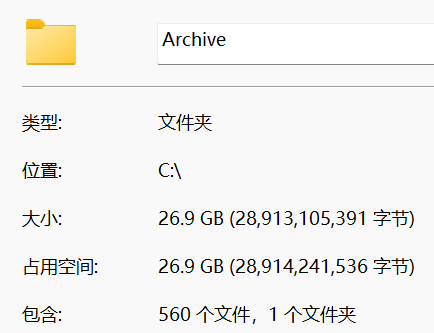

### 

#### 思路

`yt-dlp` 先下载出来视频，命名先按照 `bv` 号命名，之后用rename程序根据收藏日期重命名。

#### 一、使用 `yt-dlp` 下载视频到本地

`powershell` 中输入如下：（按照收藏夹下载）

```bash
yt-dlp "收藏夹URL" `
  --cookies "./cookies.txt" `
  -f "(bv*[fps>30]/bv*)+ba/b" `
  --merge-output-format mkv `
  --sleep-interval 1 --max-sleep-interval 3 `
  --embed-thumbnail --add-metadata `
  --continue --no-overwrites `
  --download-archive "C:/Archive/archive.txt" `
  -o "C:/Archive/%(id)s.%(ext)s"
```

PS：--download-archive archive.txt 让 `yt-dlp` 维护一个archive.txt文本文件记录所有已下载的视频 ID，防止冗余下载。 --download-sections "*00:30:24-00:35:49"  区间下载

特定活动页有可能下载失败， `powershell` 中输入如下进行下载：

```bash
yt-dlp "视频URL" `
  --cookies "./cookies.txt" `
  -f "(bv*[fps>30]/bv*)+ba/b" `
  --merge-output-format mkv `
  --embed-thumbnail --add-metadata `
  --continue --no-overwrites `
  --download-archive "C:/Archive/archive.txt" `
  -o "C:/Archive/%(id)s.%(ext)s"
```

archive.txt中保存的下载过的内容


#### 二、获取BV号和收藏时间并生成 `csv` 文件

- 打开你的收藏夹页面即可
- 保证你已经登录 B 站账号（否则接口没权限）
- 右键 → 检查 → Console
- 输入如下 `js` 即可

`bv,collect_hour,title`

```js
(async () => {
  const mediaId = "";   // 你的收藏夹 media_id
  const pageSize = 20;
  let page = 1;
  let hasMore = true;
  const results = [];

  function sleep(ms) {
    return new Promise(r => setTimeout(r, ms));
  }

  function formatHour(ts) {
    const d = new Date(ts * 1000);
    const yy = String(d.getFullYear()).slice(2);
    const mm = String(d.getMonth() + 1).padStart(2, "0");
    const dd = String(d.getDate()).padStart(2, "0");
    const hh = String(d.getHours()).padStart(2, "0");
    return `${yy}-${mm}-${dd}-${hh}`;
  }

  while (hasMore) {
    const url = `https://api.bilibili.com/x/v3/fav/resource/list?media_id=${mediaId}&pn=${page}&ps=${pageSize}`;
    console.log("Fetching page", page);

    const resp = await fetch(url, { credentials: "include" });
    const json = await resp.json();

    const medias = json?.data?.medias || [];
    hasMore = json?.data?.has_more;

    for (const m of medias) {
      if (!m.bvid || !m.fav_time) continue;

      results.push({
        bv: m.bvid,
        collect_hour: formatHour(m.fav_time),
        title: m.title.replace(/[\r\n,]+/g, " ") // 去掉换行和逗号，避免 CSV 出错
      });
    }

    page++;
    await sleep(300);
  }

  // 按时间排序（最老在前）
  results.sort((a, b) => a.collect_hour.localeCompare(b.collect_hour));

  console.table(results);

  // 导出 CSV（Excel UTF-8 BOM 兼容）
  const header = "bv,collect_hour,title\n";
  const rows = results.map(r => `${r.bv},${r.collect_hour},${r.title}`).join("\n");

  const blob = new Blob(
    ["\ufeff" + header + rows],
    { type: "text/csv;charset=utf-8;" }
  );

  const downloadUrl = URL.createObjectURL(blob);
  const a = document.createElement("a");
  a.href = downloadUrl;
  a.download = "bilibili_fav.csv";
  a.click();
  URL.revokeObjectURL(downloadUrl);

  console.log("Export done, total:", results.length);
})();
```


#### 三、修改命名

rename.py

```python
import csv
import os
import re

# ======================
# 配置区
# ======================
VIDEO_DIR = r"C:\Archive"           # 视频所在目录
CSV_PATH  = r"C:\Archive\bilibili_fav.csv"  # CSV 文件
LOG_PATH  = os.path.join(VIDEO_DIR, "rename_miss.log")
# ======================

# Windows 文件名非法字符
INVALID_CHARS = r'\/:*?"<>|'

def clean_title(title):
    for c in INVALID_CHARS:
        title = title.replace(c, "_")
    return title.strip()

# 清空日志文件
with open(LOG_PATH, "w", encoding="utf-8") as f:
    f.write("=== 缺失文件日志 ===\n")

# 读取 CSV → 建立 BV -> (时间, 标题) 映射
bv_list = []

with open(CSV_PATH, "r", encoding="utf-8-sig", newline="") as f:
    reader = csv.DictReader(f)
    for row in reader:
        bv = row["bv"].strip()
        time_prefix = row["collect_hour"].strip()
        title = clean_title(row.get("title", "").strip())
        bv_list.append((bv, time_prefix, title))

print(f"[INFO] 从 CSV 读取到 {len(bv_list)} 条记录")

# 扫描目录 → BV 文件
files_in_dir = os.listdir(VIDEO_DIR)
bv_to_file = {}

for filename in files_in_dir:
    file_path = os.path.join(VIDEO_DIR, filename)
    if not os.path.isfile(file_path):
        continue

    m = re.search(r"(BV[0-9A-Za-z]+)", filename)
    if not m:
        print(f"[SKIP] 未识别 BV: {filename}")
        continue

    bv_to_file[m.group(1)] = filename

# 批量重命名（全量，自动防覆盖）
for idx, (bv, time_prefix, title) in enumerate(bv_list, start=1):
    old_filename = bv_to_file.get(bv)
    if not old_filename:
        print(f"[MISS] 目录中找不到 BV: {bv}")
        with open(LOG_PATH, "a", encoding="utf-8") as logf:
            logf.write(f"{bv} 未找到对应文件\n")
        continue

    old_path = os.path.join(VIDEO_DIR, old_filename)
    ext = os.path.splitext(old_filename)[1]

    # 文件名格式：编号-时间-BV-标题.扩展名
    new_name = f"{idx:04d}-{time_prefix}-{bv}-{title}{ext}"
    new_path = os.path.join(VIDEO_DIR, new_name)

    # 防止意外覆盖，自动加 _1/_2 ...
    counter = 1
    base_new_name = new_name
    while os.path.exists(new_path):
        new_name = f"{os.path.splitext(base_new_name)[0]}_{counter}{ext}"
        new_path = os.path.join(VIDEO_DIR, new_name)
        counter += 1

    # 执行重命名
    try:
        os.rename(old_path, new_path)
        print(f"[{idx}/{len(bv_list)}] {old_filename} → {new_name}")
    except Exception as e:
        print(f"[ERROR] 重命名失败: {old_filename} → {new_name} ({e})")
        with open(LOG_PATH, "a", encoding="utf-8") as logf:
            logf.write(f"[ERROR] {old_filename} → {new_name} ({e})\n")

print("🎉 全量重命名完成")
```

产生 `bilibili_fav.csv`


#### 四、Tips

丢失音频视频补档方法：

```bash
ffmpeg -i "C:\Archive\1.mkv" `
       -i "C:\Archive\2.mkv" `
       -c:v copy `
       -map 0:v:0 `
       -map 1:a:0 `
       -shortest `
       "C:\Archive\output.mkv"
```


#### 五、实现结果




**PS：序号0005源丢失【未解决】**


#### 六、站内脚本命令补充

收藏夹 CSV 添加进站：
- `npm run songs:parse-csv -- ./your.csv`
- `npm run songs:parse-csv -- ./your.csv --overwrite`

同步封面与元信息：
- `npm run songs:sync:with-cover`（启用封面下载；已有封面会自动跳过）
- `npm run songs:sync:no-cover`（不下载封面，写入远程封面地址）

按 CSV 批量补标签：
- `npm run songs:add-tag-from-csv -- ./your.csv tag名称`