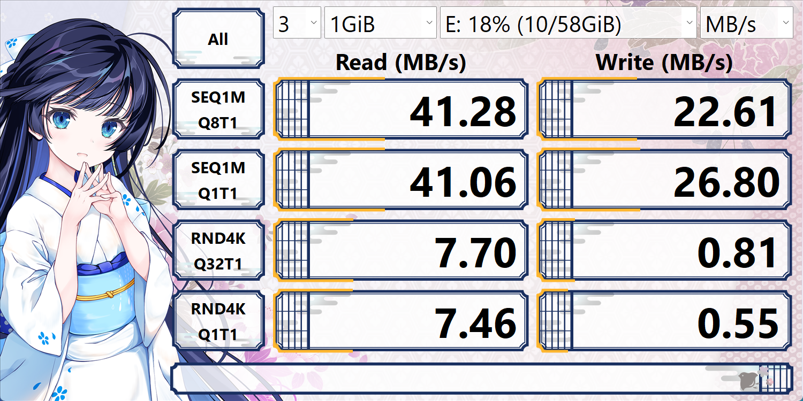
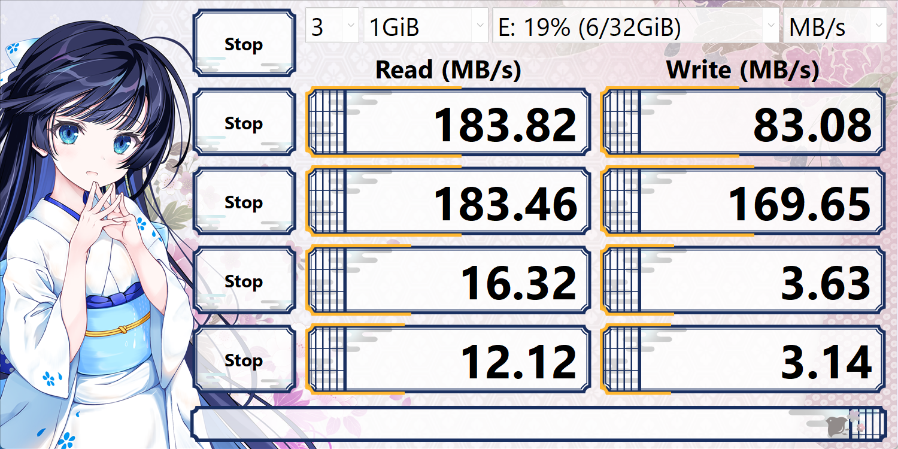

目标：十几年后还能打开这些照片和视频

新机械硬盘 + 备份 + 云

### 使用原则

- 拷完就断电
- 不长期通电
- 不频繁插拔

### 📅 维护频率

- **半年通一次电**
- 简单读几个文件

### 存储介质

#### microSD:

ADATA 2GB [数据已转移-20260206]

Kingston 8GB [数据已转移-20260206]

SEAOMARLON 128GB [打不开]

#### U盘:

黑底64GB

蓝底32GB

