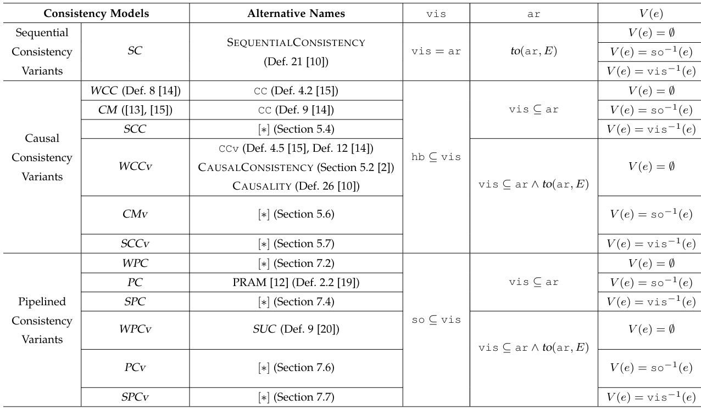

### 一致性模型定义



### 代码仓库

代码仓库：https://github.com/code-artifacts/cm-alloy
论文仓库：https://github.com/research-papers-by-hfwei/alloy-cm

获取一个历史的`hola`定义

```bash
python transformer\transformer.py --input [输入历史txt] --output [输出历史als]
python transformer\transformerWithRf.py --input [输入历史txt] --output [输出历史als]
```

通过java打开`hola`包和对应的`checkingWithRf`规则

```bash
java -jar D:\Projects\cm\hola-0.3_2019-03-23.jar ./checkingWithRf.als
```

以上两个步骤通过下面批处理文件一次性解决：

```bash
check.bat testHistory\[name].txt
```

弹出GUI后点击Execute - Check `notWCC`，如果找到了反例，说明找到了一个组合满足WCC，即满足WCC模型。

但是这样看时间比较麻烦，创建test\AutoCheck.java来获取运行时间。

```bash
java -cp "test;D:\Projects\cm\hola-0.3_2019-03-23.jar" AutoCheck checkingWithRf.als notCM
python test\benchmark.py --input testHistory\cm-not-scc.txt -n 1 -k 30 -p notSCCv 
[n轮数 k时间]
python test\run_all_benchmarks.py -n 3 -k 15
python test\compare_benchmarks.py --old test\report_ALL_20260515_220904v0.csv --new test\report_ALL_20260515_225246v3.csv
```

