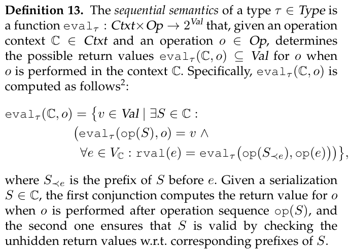
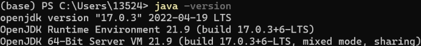
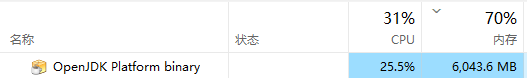
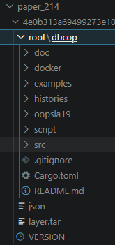

# 一、一致性模型拓展框架

论文：`TPDS2025 A Generic Specification Framework for Weakly Consistent Replicated Data Types.pdf`

已有工作：`(vis, ar)` 框架是一个**统一描述分布式一致性模型的抽象工具**，用两个关系来刻画：

- **vis（visibility）**：谁“看到了谁”
- **ar（arbitration）**：全局顺序怎么排
- 要求全序 ar → 无法表达 **非收敛模型（CM）**
- 忽略返回值 → 无法满足CM读的值必须被“解释”这一原则

上面两个问题，引出了一个拓展框架，[vis ar V]框架

核心公式如下：找到一个线性序列**同时**能解释事件的返回值**并**能解释这个事件的V集合里面事件的返回值



最终将所有一致性模型都用新框架描述：


# 二、alloy*代码描述一致性模型

论文：`江雪-博士论文-20240517`

代码仓库：https://github.com/code-artifacts/cm-alloy
论文仓库：https://github.com/research-papers-by-hfwei/alloy-cm

## 1.语言 alloy*（hola）

代码仓库：https://github.com/aleksandarmilicevic/hola

Alloy*(HOLA) 本质上是：Java 写的、打包成 `.jar` 、依赖 JVM（Java Virtual Machine）

这里 安装`Temurin`，即Java发行版OpenJDK的现成编译版本（Java运行环境）



```bash
运行：
java -jar hola-0.3_2019-03-23.jar
```

## 2.论文代码部分

### 模型比较

构造历史来判断是否满足A不满足B，下面为优化

- 写操作都不能写入初始值0
- 保证有一个以上的非同进程的rf关系
- 去除会话 键 值 对称性

### 模型测试

在`CausalMemoryConvergence`的模型测试中，如果一个会话中包含多个读事件，验证最后一个读事件的返回值即可，因为最后一个会把前面的都解释了

## 3.代码性能优化

### 1）**Java/Hola**代码修改后的时间对比【已废弃】

1）输入`txt`历史，使用`transformerWithRf.py`将`txt`转换为`als`历史

```bash
python transformer\transformer.py --input [输入历史txt] --output [输出历史als]
python transformer\transformerWithRf.py --input [输入历史txt] --output [输出历史als]
```

2）通过java打开`hola`包和对应的`checkingWithRf`规则

```bash
java -jar D:\Projects\cm\hola-0.3_2019-03-23.jar ./checkingWithRf.als
```


以上两个步骤通过下面批处理文件一次性解决：

```bash
check.bat testHistory\[name].txt
```

弹出GUI后点击Execute - Check `notWCC`，如果找到了反例，说明找到了一个组合满足WCC，即满足WCC模型。这里输出时间。


但是这样看时间比较麻烦，创建test\AutoCheck.java来获取运行时间。

```bash
java -cp "test;D:\Projects\cm\hola-0.3_2019-03-23.jar" AutoCheck checkingWithRf.als notCM
```

创建benchmark来获取多次运行时间花费 [n轮数 k时间]

```bash
python test\benchmark.py --input testHistory\cm-not-scc.txt -n 1 -k 30 -p notSCCv 
python test\run_all_benchmarks.py -n 3 -k 15
python test\compare_benchmarks.py --old test\report_ALL_20260515_220904v0.csv --new test\report_ALL_20260515_225246v3.csv
```


三种测试时间方法：

```
check.bat                                     批量跑 testHistory/
check.bat <file>                              单文件，默认 WCC
check.bat <file> [model]                      单文件，指定模型
check.bat <file> [--all] [--time]             单文件全部 6 模型，可选打印耗时
check.bat <file> [--java] [model]             Java/Hola 后端
check.bat <file> [--java] [--all]             Java/Hola 全部 6 模型
check.bat <file> [--gui]                      打开 Alloy 图形界面
```


### 2）使用Hola无法解决大历史

```bash
check.bat testHistory\large\generated_wcc_not_cm_100e_shortseq.txt --java
```



内存占用和运行时间都很大

原因：**Hola/Alloy（通用高阶 SAT 求解）**

`some ar: E->E | IsTotalOrder[ar]` 这句话会被翻译成 SAT：

- 对 n 个事件，`ar` 关系有 n² 个布尔变量
- 全序的传递性 `ar.ar in ar` 展开成 n³ 个 SAT 子句
- `some lin: writes->writes` 又是一个 n² 变量、n³ 子句的高阶量词
- 每个 read 的 `JustifyValueOfRead` 再产生额外的约束

50 个事件 = 2500 个 ar 变量 + 传递性子句 = SAT 规模直接爆炸，内存几个 GB 起步。


这里100个事件就已经运行困难了。


### 3）C++ solver来解决

我们不做 SAT 翻译，而是直接利用问题结构：

- `hb = ^(so + rf)`：bitset + 拓扑 DP，O(n²/64)，不是 SAT 子句
- `ar` 不需要显式枚举：约束图用 O(n) 条直接边，拓扑序本身就隐含了全序
- 回溯只在多候选 read 时发生，多数场景退化为单次拓扑检查

所以 5000 事件 C++ 跑 13ms，Hola 跑 50 事件可能就要几十秒。**不是 Hola 不好，是它做的是通用 SAT 求解，我们做的是专用算法。**

#### 生成大历史压测

```bash
# 差分测试：随机生成历史，C++ 和 Python 交叉比对正确性
python solver/difftest.py --cases 1000 --seed 42 --max-events 20

python solver/gen_stress.py --mode lin --events 5000 --sessions 8 --out test.txt
# mode 可选：
#   lin          线性化执行，值各不相同  → 全 1
#   lin-rep      线性化但值重复         → 硬模式
#   wcc-not-cm   经典反例放大版         → WCC=1，其余因模型而异
#   cyclic       带 so+rf 环            → 全 0（测拒绝速度）

# 改完代码后的标准流程：
g++ -O3 -std=c++17 -o solver/fast_solver.exe solver/fast_solver.cpp
python solver/difftest.py --cases 3000
python solver/gen_stress.py --mode lin --events 5000 --out /tmp/t.txt
./solver/fast_solver.exe --input /tmp/t.txt --all --time
```

## 4.数据集测试

### dbcop (OOPSLA 2019)数据集

[On the Complexity of Checking Transactional Consistency](https://zenodo.org/records/3370437)

具体介绍：分布式数据库一致性验证工具，包含 4302 个真实执行轨迹。

三个数据库在故障注入下并发跑读写 → 记录每个 session 的操作历史 → 用于一致性验证。

  AntidoteDB      500 条   因果一致性
  Galera          500 条   快照隔离
  CockroachDB    3302 条   可串行化快照隔离

每条历史 1500~9000 个事件，多 session 并发，含分区/故障场景。

数据集如图：4302 个 dbcop 历史



其他文件夹为docker不同层

这里采用如下将其转换为txt文件

```bash
python solver/convert_dbcop.py --all
```

运行命令如下：

```bash
check.bat testHistory\dbcop\antidote_xxx.txt --all
```

结论：

- **AntidoteDB** 是因果数据库，WCC/CM 全部通过；但 SCC 跨 session 读约束全部失败
- **Galera / CockroachDB** 全写负载下大量 write-write 冲突，大部分历史不满足因果一致性
- WCC=CM、SCC=CMv=SCCv 说明在这些数据上 Ve 约束没引入额外区分力，分界线是 **是否跨 session 可见读**（SCC 族 vs WCC 族）

